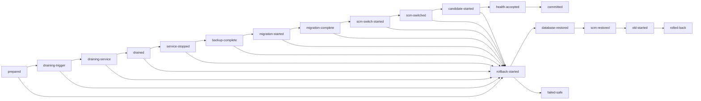

# 原子载荷切换与数据库迁移设计

> 状态：设计基线与第一阶段实现。版本化载荷、持久部署日志、严格 drain、在线日志轮转、数据库 schema 账本、包内迁移契约以及 v2 备份/恢复工具已经有本地自动化证据；签名迁移执行器、开机 `recover-only`、逐 phase 断电注入、真实 MySQL/管理员目标机演练尚未完成。该项在全部验收证据归档前仍属于 P0 No-Go。

## 1. 目的与边界

本文定义 `SteelInspectionRuntime` 后台运行包的版本化部署、业务排空、数据库迁移、SCM 激活、崩溃恢复、回滚和卸载契约。目标不是宣称文件、SCM 和数据库之间存在一个 Windows 原生的跨资源原子事务，而是通过不可变版本目录、单一持久升级日志和幂等恢复，让任意中断点最终只收敛到以下三种可解释状态：

- `committed`：新载荷、新 schema、SCM、运行环境和活动版本记录一致；
- `rolled-back`：数据库、SCM、运行环境和活动版本全部恢复到旧版本；
- `failed-safe`：无法证明旧版本可安全读取当前数据库时，服务保持停止并等待前向修复，绝不盲目拉起旧程序。

本文不把以下事项视为已完成：真实管理员目标机演练、MySQL DBA 恢复演练、断电测试、真实签名候选包切换，以及不可逆迁移审批。

当前实现与本设计的对应关系如下：

| 能力 | 当前实现 | 仍缺的生产证据/代码 |
| --- | --- | --- |
| 不可变载荷 | 安装器把只读源包复制到同卷 `.incoming-<transactionId>`，对源、暂存和最终版本目录重复执行完整 catalog/签名验证，再 rename 到 `releases/<semver>-<commit12>`；SCM 直接指向该目录 | 真实签名 formal-release 包与管理员目标机 ACL/SCM 证据 |
| 部署事务 | `Global\SteelInspectionRuntime-Deployment`、`upgrade.json`、`active.json`、history/backups、write-through + `Flush(true)` + replace/readback 已实现；安装、升级、备份、恢复和卸载共用互斥锁。DB 未开始且证据完整的中断可自动恢复，其余中断 fail-safe | 数据库迁移 phase、签名 native `recover-only` 和开机恢复任务；逐 phase kill/断电矩阵 |
| 业务排空 | Trigger/Service admission 与 `inFlight` 原子化；Supervisor 依次 drain，两端连续 4 次为零后才停子进程 | 真实吞吐下维护窗口和 SCM stop 证据 |
| 数据库版本 | `steel_schema_state`/`steel_schema_migration`、`steel.database-contract.v1` 与迁移索引验证已实现；安装器在 catalog 验真后校验契约，并在写部署状态前拒绝非空 migration index；升级或复用保留 StateRoot 的重装要求旧 active schema 与目标相同 | 当前索引 `base=target=1` 且为空；尚无生产迁移执行器和真实 v1→v2 迁移 |
| 灾备 | `steel.database-backup.v2`、SQLite 完整性/外键/账本验证、同卷原子恢复、MySQL InnoDB 检查与临时库恢复证明已编码；正式报告另有 `steel.report-archive-backup.v1` 全树校验、稳定快照、离线恢复和旧树保留；SQLite 与报告归档恢复正/负契约通过 | 真实在线备份、新机数据库+报告联合恢复、MySQL 临时库/回退演练与运维签字 |

## 2. 核心不变量

任何实现都必须同时满足：

1. 已批准 payload 是不可变、完整 catalog 覆盖的版本目录；升级日志、备份、状态和 `current` 辅助链接不得写入 payload。
2. SCM `ImagePath` 直接指向版本目录，不以 junction/symlink 作为启动真相源。
3. 数据库 schema 由数据库内账本决定；包内 manifest 只声明候选可读、可升级和目标范围。
4. 每次改变数据库、SCM、环境或活动版本记录前后，都先持久化一个可恢复 phase。
5. drain 完成必须证明“拒绝新工作且进行中工作为零”，不能只证明某个布尔值为 false。
6. 旧版本只有在其声明的可读 schema 范围覆盖当前数据库时才能恢复运行。
7. 任何 hash、版本、engine、路径、事务 ID 或 release identity 不一致都 fail-closed。
8. 同一时刻全机只允许一个部署事务；所有安装、升级、恢复和卸载入口共用全局互斥锁。

## 3. 目录与信任边界

推荐目录如下：

```text
%ProgramFiles%\SteelInspectionRuntime\
└── releases\
    ├── 1.2.3-a1b2c3d4e5f6\        # 不可变、catalog 覆盖、SCM 可指向
    ├── 1.2.4-b2c3d4e5f6a7\
    └── .incoming-<transactionId>\ # 同卷暂存，发布完成后 rename

%ProgramData%\SteelInspectionRuntime\
├── config\
├── logs\
├── deployment\
│   ├── upgrade.json               # 唯一进行中事务
│   ├── active.json                # 最近一次已提交状态
│   ├── history\<transactionId>.json
│   └── backups\<transactionId>\...
└── ...                            # SQLite、相机配置和其他可变状态
```

候选包先在源位置完成完整验证，再复制到与 `releases` 同卷的 `.incoming-<transactionId>`。暂存根和全部子项拒绝 reparse point；暂存副本再次验证后施加 SYSTEM/Administrators 只读执行 ACL，并在只读状态再验证一次。关闭句柄后 rename 到尚不存在的 `<semver>-<commit12>`，最终路径再次执行无跳过的完整验证。算法准入和 Supervisor preflight 在停旧服务之前完成。

当前实现对同名最终目录一律拒绝覆盖或复用；运维必须先核对既有目录、`active.json`、SCM 和 history，不能让一次重跑把已发布字节静默当作新事务。非权威 `current` 链接可以在提交后供人工查看，但不能进入 SCM `ImagePath`，也不能作为恢复依据。

## 4. 包内数据库契约

`steel.runtime-package.v1` 的 `database` 字段应由 checksum 和正式 catalog 覆盖：

```json
{
  "contractSchema": "steel.database-contract.v1",
  "schemaVersion": 3,
  "minUpgradeableSchemaVersion": 1,
  "maxUpgradeableSchemaVersion": 2,
  "minReadableSchemaVersion": 2,
  "maxReadableSchemaVersion": 3,
  "rollbackReadableThrough": 2,
  "engines": ["sqlite", "mysql"],
  "migrationIndex": "database/migrations/index.json",
  "migrationIndexSha256": "<64-lowercase-hex>",
  "stateLayoutVersion": 1
}
```

字段含义：

- `schemaVersion`：候选提交后数据库必须达到的唯一目标版本；
- `min/maxUpgradeableSchemaVersion`：候选允许直接升级的来源闭区间；
- `min/maxReadableSchemaVersion`：候选服务允许启动读取的闭区间；
- `rollbackReadableThrough`：不恢复备份时，上一版本保证可读到的最高版本；
- `stateLayoutVersion`：`StateRoot` 可变文件布局版本，不能借数据库版本隐式表达。

迁移索引每项固定包含：

```json
{
  "id": "002-add-inspection-trace",
  "fromVersion": 1,
  "toVersion": 2,
  "engine": "sqlite",
  "path": "sqlite/002-up.sql",
  "sha256": "<64-lowercase-hex>",
  "mode": "offline",
  "reversible": true,
  "rollbackPath": "sqlite/002-down.sql",
  "rollbackSha256": "<64-lowercase-hex>",
  "transactionModel": "sqlite-transactional",
  "estimatedLockSeconds": 10
}
```

索引必须验证 schema、外部批准 hash、包内路径、逐文件 hash、engine、唯一连续版本链和回滚字段一致性。迁移只能由候选 payload 中已签名且受 catalog 覆盖的迁移器执行，禁止执行 `StateRoot` 中的脚本。

## 5. 数据库权威账本

数据库至少包含：

```text
steel_schema_state
  singleton_id PK
  current_version
  dirty
  active_migration_id
  updated_at

steel_schema_migration
  migration_id PK
  from_version
  to_version
  engine
  checksum
  release_version
  release_commit
  transaction_id
  state
  started_at
  applied_at
  error
```

服务正常启动只允许创建全新数据库或验证已有 schema 的可读范围，不再通过匹配 `duplicate/already exists` 错误字符串隐式吞掉 DDL。生产 schema 变化必须经过离线迁移器，且同一 migration ID 一旦写入，其 checksum 永远不能变化。

### 5.1 SQLite

- drain 并停服后获取 `BEGIN IMMEDIATE`；
- 每步 SQL、`steel_schema_migration=applied` 和 `current_version` 更新处于同一事务；
- 迁移前后执行 `PRAGMA foreign_key_check` 与 `quick_check`，发布演练执行完整 `integrity_check`；
- 进程崩溃依赖 SQLite 事务回滚，外部 `upgrade.json` 决定重试或恢复旧版本；
- 恢复前确保所有进程已退出，将失败数据库 rename 到 quarantine，验证备份 hash/schema/integrity 后再替换 live DB，并清理旧 `-wal/-shm`。

### 5.2 MySQL

- 通过独立迁移凭据连接，并获取 `GET_LOCK('steel_schema_migration', timeout)`；
- 逐步校验 `information_schema` 前置条件和已应用 checksum；
- MySQL DDL 可能隐式提交，禁止把它描述为可事务回滚；
- 自动回退只允许经过验证的 expand/contract 迁移：本版 additive/dual-read-write，至少跨一个回退窗口后才 contract；
- 破坏性或不可逆迁移必须显式标记，取得单独审批；候选失败时进入 `failed-safe`，由 DBA 恢复或执行前向修复。

## 6. 业务排空契约

升级先 drain Trigger，再 drain Service。两端必须使用原子 admission guard：在同一个临界区内检查 `accepting` 并递增 `inFlight`，请求结束由 guard 自动递减；否则“检查后、drain 前”仍可能放入新请求。

Trigger 排空完成条件：

```text
accepting == false
inFlight == 0
```

Service 排空完成条件：

```text
admission.accepting == false
admission.inFlight == 0
activeSession == null
tasks.queueDepth == 0
tasks.worker.activeTaskId == null
```

Service drain 必须先原子关闭准入并发布 draining 状态，再等待生产命令锁屏障；这样持锁运行的纯算法计算能观察到 drain 并合作取消，而已越过相机或设备写入边界的调用仍以真实结果收敛。排空期间拒绝所有会产生新工作或新副作用的路由，只保留 status、steel-out、取消既有任务和既有幂等请求完成所需的白名单接口。Trigger 排空时只允许 steel-out 完成。当前 Supervisor 先请求 Trigger drain，再请求 Service drain，要求上述两组状态连续 4 次为零；业务排空最多 60 秒。之后所有子进程同时收到 `CTRL_BREAK`，共享 15 秒优雅退出窗口、最多 5 秒强停收敛和两个 5 秒日志泵退出/取消窗口；停止阶段最多 30 秒，SCM 最坏总预算约 90 秒，wait hint 为 100 秒，安装器等待 120 秒。业务 drain 超时必须在证据中标记，不能伪装为正常排空。

## 7. 升级事务状态机

`$StateRoot\deployment\upgrade.json` 是跨文件、SCM 和数据库恢复的唯一权威日志。每次写入使用同目录临时文件、write-through/flush-to-disk、原子替换，并在返回前重新读取校验 `transactionId`、phase 和内容 hash。

下图是完整目标状态机。当前安装器已实现 `prepared`、载荷发布、preflight、停服、SCM 切换、启动/配置、`committed`、`rolled-back` 与 `failed-safe` 的文件/SCM 子集，并把 `database.phase` 固定初始化为 `not-started`。只要 DB phase 不是可证明的 `not-started`，启动时恢复就拒绝猜测并进入 failed-safe。图中的 drain、backup、migration、health-accepted 和签名 native 开机恢复尚未全部编排进同一事务，因此不能把当前 `-Upgrade` 称为完整数据库原子升级。



执行顺序：

1. 获取 `Global\SteelInspectionRuntime-Deployment` mutex；发现未完成 journal 时先恢复，禁止开始新事务。
2. 验证并发布候选版本目录；快照旧 SCM、failure actions、环境、注册表、`active.json` 和数据库 schema。
3. 暂时把 SCM start mode 设为 demand 并禁用自动故障拉起；执行严格 drain。
4. 正常停止服务，生成并验证数据库/配置备份。
5. 使用候选迁移器迁移并验证目标 schema。
6. 把 SCM `ImagePath` 改为候选版本目录，这是活动二进制指针的提交点；注册表值只是伴随元数据。
7. 启动候选，验证应用 readiness、release identity、commit、schema、capture、trigger 和 task worker，并保持稳定观察窗。
8. 原子写 `active.json` 和 history 收据，恢复 delayed-auto 与有界 failure actions，phase 置为 `committed`。

## 8. 崩溃恢复决策

| 中断位置 | 恢复动作 |
| --- | --- |
| `prepared` 至 `service-stopped`，DB 未变 | 恢复旧 SCM/env/start 状态；必要时恢复接单 |
| `migration-started`，DB 账本仍为来源版本 | 证明事务未提交后幂等重跑，或回到旧版本 |
| DB 已为目标版本且旧版仍声明可读 | 优先按策略恢复已验证备份；恢复成功后再切回旧 SCM |
| DB 已为目标版本但旧版不可读/迁移不可逆 | 进入 `failed-safe`，SCM 保持 demand、服务停止，等待前向修复或 DBA 恢复 |
| `scm-switched` 之后 | 核对实际 `ImagePath`、DB schema 和候选身份；一致则继续验收，否则按兼容性回退 |
| `health-accepted` 之后 | 幂等写 active/history，恢复 failure actions 并完成 commit |

仅“下次运行安装器时恢复”不足以覆盖无人值守重启。生产实现应在 `prepared` 后注册 LocalSystem 一次性恢复任务，调用已签名、版本化、catalog 覆盖的 native recovery tool；提交或回退后删除任务。可变 unsigned 脚本不得充当稳定恢复入口。

## 9. 备份契约

`backup-database.ps1` 只接受一个已安装的不可变 runtime root，并要求 `active.json` 与包内 manifest 的 release、commit、release root 和 transaction ID 完全一致。默认还要求 `packageClass=formal-release` 且 `source.dirty=false`；`-AllowEngineeringPackage` 只供非生产测试。它不再从当前 Git 仓库或 `Cargo.toml` 猜测备份身份。备份与恢复从读取 active identity 到完成发布/收据的整个过程都持有 `Global\SteelInspectionRuntime-Deployment`，与安装、升级和卸载串行；30 秒内拿不到锁即在数据库变更前失败。

完成目录中的 `manifest.json` 使用 `steel.database-backup.v2`，核心结构如下；真实文件还记录服务报告、工具 hash/版本和产物根：

```json
{
  "schema": "steel.database-backup.v2",
  "backupId": "<uuid>",
  "engine": "sqlite",
  "createdAtUtc": "<UTC timestamp>",
  "release": {
    "releaseId": "1.2.3-a1b2c3d4e5f6",
    "releaseVersion": "1.2.3",
    "releaseCommit": "<full commit>",
    "transactionId": "<deployment uuid>",
    "packageManifestSha256": "<sha256>",
    "activeDeploymentSha256": "<sha256>"
  },
  "database": {
    "schemaVersion": 1,
    "contractSchema": "steel.database-contract.v1",
    "contractSha256": "<sha256>",
    "migrationIndexSha256": "<sha256>",
    "stateLayoutVersion": 1,
    "mysqlDatabase": null,
    "serverVersion": "winsqlite3"
  },
  "payload": {
    "file": "steel-inspection.sqlite",
    "bytes": 123,
    "sha256": "<sha256>",
    "consistencyModel": "sqlite-vacuum-into"
  },
  "verification": {
    "status": "passed",
    "method": "winsqlite3-readonly-integrity-check",
    "schemaVersion": 1,
    "integrityCheck": "ok",
    "foreignKeyViolations": 0,
    "unresolvedMigrations": 0
  }
}
```

SQLite 由已认证服务端点执行 `VACUUM INTO`，下载后用 Windows `winsqlite3.dll` 只读执行完整 `PRAGMA integrity_check`、`foreign_key_check`，并验证 schema singleton、`dirty=0`、无 active/unresolved migration。备份先在 `.incomplete-*` 目录生成，payload 以 write-through/`Flush(true)` 落盘，manifest 自校验通过后才同卷 rename 为完成目录。

MySQL 路径先直接查询 schema/migration 账本和 `information_schema`。只有全部业务表为 InnoDB 才允许 `--single-transaction`；dump 不携带目标库 `CREATE/USE`，随后必须恢复到操作者明确命名并用 `-AllowMySqlVerificationDatabaseReset` 二次确认的临时数据库，核对 schema 账本和基表数量，再删除临时库。临时恢复或清理不能证明成功时整次备份失败。当前 v2 未记录 GTID/binlog 坐标或加密/签名封装；需要时间点恢复或离机合规存储时，这两项仍是 DBA 设计增量，不能从现有 manifest 推断。

恢复必须停服，并从另一信任通道提供 `ExpectedBackupManifestSha256`；包内自报 hash 不能代替它。脚本同时验证 backup payload、目标 release 的 database contract/index、`active.json` 以及 `min/maxReadableSchemaVersion` 和 `rollbackReadableThrough`。确认短语固定为：

```text
RESTORE <engine> <backupId> TO <targetReleaseId>
```

SQLite 先 checkpoint 并要求 WAL 不含待提交字节，持久化旧库 rollback copy，再把已验证快照复制到同目录 staging；已有库使用 `File.Replace` 同卷原子切换，无旧库时使用同卷 rename。切换后重新执行完整只读验证；失败时自动恢复持久 rollback copy，无法证明恢复则写 `failed-safe` 收据并保持服务停止。MySQL 导入不是原子操作，必须显式 `-AllowNonAtomicMySqlRestore`，并额外提供一份不同 `backupId`、独立 hash 固定的当前目标库 pre-restore backup；导入失败只进入 failed-safe，由 DBA 按该备份恢复，不声称脚本能自动回滚 DDL。

成功或异常切换都会把 `steel.database-restore-receipt.v2` 写入 `StateRoot\deployment\restore-history`。工具成功仅表示离线 payload/schema 验证通过，服务仍保持停止；启动固定 target release、通过数据库与完整 runtime readiness、再恢复 admission 是独立且必需的后续步骤。

## 10. 候选健康验收

SCM 状态 `Running` 只是进程存在证据。提交前必须连续稳定窗口内验证：

- `/api/health/ready/details` 为 ready；
- release version、Git commit、payload/catalog hash 与候选 manifest 完全一致；
- database engine、schema version、dirty=false；
- capture、trigger listener、生产任务 worker 均 ready；
- admission 恢复前仍为停止接单；
- 没有活动 migration、未决 fence、队列或异常重启预算。

只有写入 `committed` 后才能恢复接单。任何身份或 schema 不匹配均按数据库兼容规则回退或进入 `failed-safe`。

## 11. 卸载与版本保留

当前卸载器与安装器共用部署 mutex，并在任何 SCM 变更前验证 registry、SCM `ImagePath`、`active.json`、journal、`InstallRoot`、`StateRoot` 与精确当前 release 目录相互一致。journal 只有 `committed` 或 `rolled-back` 才允许继续；`failed-safe`、非终态、损坏或越界 history/backup 引用全部拒绝，等待人工恢复，不能用卸载绕过 failed-safe。

默认卸载顺序为：有界停服并删除 SCM，确认服务注册表项消失，确认 TCP/UDP `4317/4873/4881/4882/4883` 全部释放，然后只删除 `InstallRoot\releases` 下与 SCM/active 精确绑定的当前直系版本目录。它保留其它 releases、整个 `StateRoot`、部署 history/backups、数据库、日志、配置和外部秘密/算法报告；`-RemoveRuntimeEnvironment` 只额外删除 `StateRoot\config\runtime-service.env`。

`-Purge` 是显式、顺序且非跨资源原子的破坏性动作。它要求同时显式传入 `-InstallRoot` 与 `-StateRoot`、已有可信部署证据，并按解析后的绝对路径提供精确确认短语：

```text
PURGE SteelInspectionRuntime|INSTALL=<absolute InstallRoot>|STATE=<absolute StateRoot>
```

卷根、Program Files 根、ProgramData 根、Windows 根、重叠根和任何 reparse tree 都被拒绝；Purge 仍不会删除两个根之外的秘密、算法报告或外部产物目录。真实管理员卸载/Purge 与保留策略仍必须在目标机演练并归档。

## 12. 故障注入与上线证据

自动化至少在每个 phase 写入前后、目录 rename 前后、备份后、每条 migration 中、`sc config` 后、候选启动后和 health accepted 后注入进程终止。重新执行 recover-only 后，SCM ImagePath、`active.json`、DB schema 和 env 必须四者一致，并收敛到三个终态之一。

另外必须覆盖：

- 不同卷 stage、已存在但内容不同的版本目录、payload 内 junction/symlink；
- catalog 在复制/rename/ACL 后仍完整有效；
- 部署 mutex 并发、截断 journal、遗留 temp；
- SQLite WAL、大库、迁移事务中断、备份 hash 或 integrity 失败；
- MySQL 非 InnoDB、GET_LOCK 冲突、DDL 中断、临时库恢复失败；
- 候选 SCM Running 但 readiness、release 或 schema 不匹配；
- 旧版不兼容新 schema 时绝不启动；
- 普通 uninstall 只删除精确当前 release，保留其它 releases、StateRoot、history/backups；非终态/failed-safe journal 必须在 SCM 变更前拒绝。

现场证据必须绑定 release commit、包/manifest/catalog hash、旧/新 schema、目标机、执行人和时间，保存每个 fault point 的 journal、SCM 查询、数据库账本、health 响应与最终收敛结果。

## 13. 分阶段实现门禁

| 阶段 | 实现范围 | 当前状态 | 退出条件 |
| --- | --- | --- | --- |
| U1 | 严格 admission/in-flight drain 与实时日志轮转 | 代码与本地综合测试完成：Service 134/134、Trigger 17/17、Supervisor drain/超时/50 MiB 在线轮转与 5 代保留通过 | 管理员 SCM 真实启停和生产并发负载证据归档 |
| U2 | 数据库 contract、账本、离线迁移器和 v2 备份 manifest | contract/账本/包校验和 v2 SQLite 恢复契约完成；生产迁移器与真实 MySQL 演练未完成 | SQLite 逐迁移故障注入全绿；MySQL 临时恢复与 expand/contract 评审、演练通过 |
| U3 | 版本目录、持久 journal、SCM 指针切换、recover-only | 版本目录、三段完整验证、mutex、journal、pre-DB 恢复、SCM 直指及保守卸载已完成；卸载策略测试 14/14，DB phase/recover-only 未完成 | 每个 phase kill/retry 收敛，开机恢复可用且 SCM/active/DB/env 四类状态一致；管理员目标机卸载/Purge 通过 |
| U4 | 真实签名候选包管理员目标机演练 | 未开始 | install/upgrade/rollback/uninstall、断电和 ACL 证据归档 |

U1/U2/U3 的源码或单元测试完成不等于 U4 完成；U4 前本项始终维持 P0 No-Go。
