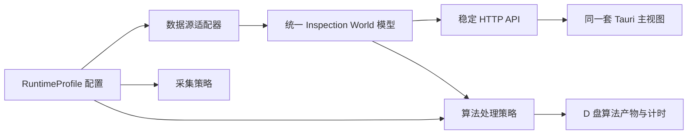

# 配置驱动的数据源、采集与算法架构

> 当前模块所有权、依赖方向和响应式图像契约以 [检测系统边界与响应式缩略图决策](design/inspection-boundaries-responsive-thumbnail.md) 为准。

## 目标

现场是否能够连接相机不应决定前端或 HTTP API 的形态。运行模式只选择数据源并声明能力，采集、算法处理和产物存储分别由配置控制。所有数据源最终提供同一组检测世界接口：

- `GET /api/inspection-world/records`
- `GET /api/inspection-world/meta`
- `GET /api/inspection-world/defects`
- `GET /api/inspection-world/preview`（目标主显示契约）
- `GET /api/inspection-world/tile`（迁移期旧客户端兼容）

前端只使用以上接口，不判断 MySQL、共享目录、离线转换库或相机 SDK。

## 分层



### 数据源适配器

适配器只负责把现场数据翻译成统一记录、相机帧和缺陷坐标：

- `online-production`：内部生产数据库和采集文件；
- `bkv-online-mysql`：现场 MySQL 加 `CamImageSource*` 只读共享目录；
- `converted-local`：离线转换目录和本地目录库。

适配器差异被限制在服务端，不能扩散到 React 组件或新增一组模式专用 API。

### 采集策略

`capture.enabled` 表示该模式是否允许采集，`capture.autostart` 表示服务启动时是否拉起采集进程。BKV 在线和离线模式均不连接相机，因此两项为 `false`；直连模式为 `true`。

数据源可读与采集运行是两个独立状态。读取历史或共享目录时，不再把虚拟的 BKV 数据源报告成正在采集。

### 算法处理策略

`algorithm` 配置选择处理器、版本化参数文件、自动处理策略、最大帧数和输出目录。算法处理器接收统一的记录身份，输出检测世界清单、对齐结果、瓦片缓存和耗时证据。

BKV 在线处理器不复制几百兆原始图像。它只读共享目录，计算相机头部对齐和检测世界元数据，并在请求瓦片时按需生成缓存。MySQL 业务记录和缺陷明细体积较小，按配置转存为原子 JSON 快照，确保算法结果可以脱离现场数据库追溯。

## 产物布局

当前 BKV 在线配置输出到：

```text
D:\steel-inspection\algorithm-data\
  processing-times.jsonl
  source-data\
    mysql\
      latest-500.json
  runs\
    <SeqNo>\
      inspection-world-v1\
        manifest.json
        source-record.json
        timing.json
        tiles\
          camera<id>\
            level<level>\
              <x>_<y>.jpg
```

`latest-500.json` 是最近 500 条 MySQL 记录、缺陷类型、逐记录缺陷明细和同步时间的滚动快照，不包含连接密码。`source-record.json` 固化本次算法运行对应的单条 MySQL 记录及缺陷，和图像算法清单保持同目录。`manifest.json` 记录输入来源、帧数量、相机尺寸、对齐结果、世界尺寸和输入修订号。`timing.json` 记录发现、对齐、持久化和总耗时。`processing-times.jsonl` 是跨记录追加的算法计时流水。

## 配置边界

运行配置是非敏感行为的唯一来源：

- 数据源：`dataSource`
- 是否采集：`capture.enabled`
- 是否自动启动采集：`capture.autostart`
- 是否处理及处理器：`algorithm.enabled`、`algorithm.processor`
- 是否跟随最新记录处理：`algorithm.autoProcessLatest`
- 算法产物位置：`algorithm.outputRoot`
- 算法计时位置：`algorithm.timingLog`
- 是否转存 MySQL 数据：`algorithm.sourceData.enabled`
- MySQL 快照目录与记录数：`algorithm.sourceData.directory`、`algorithm.sourceData.recordLimit`

MySQL 密码等敏感值仍通过本机环境文件提供，不写入版本库。

## 冗余控制

新增现场时优先增加一个数据源适配器和一份运行配置，禁止复制主视图、算法控制器或 HTTP 路由。处理器输出必须使用统一检测世界模型；API 路由只做参数校验、调用统一能力并编码响应。
