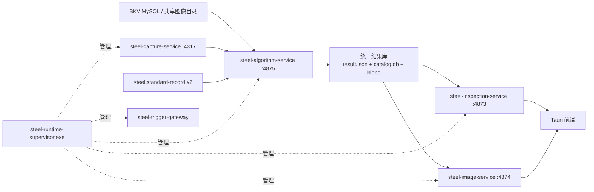

# 原始数据处理链路与独立运行架构

## 固定数据流

业务服务在生产模式只读统一结果库，不读取 BKV、共享目录或采集原始目录，也不启动算法/采集子进程。Supervisor 按图像、算法、采集、业务、触发网关的顺序启动并按反向顺序停止。`steel-inspection-tray.exe` 只控制 SCM，不持有管理员凭据；独立的 Tauri 服务器任务监控只读健康、队列和最近任务状态，不执行 SCM 或生产任务写操作。

## 统一结果协议

`steel.inspection-result.v1` 由 `app/result-contract` 定义。算法服务发布任务时先写入同一 NTFS 卷上的 `staging/<job>`，校验来源文件大小与 SHA-256，将二维全分辨率文件放入 `blobs/<sha256>`，再原子切换到 `records/<inspectionId>`，最后在 SQLite 事务中更新 `catalog.db` 的代数、记录、缺陷和制品索引。失败任务不会出现在业务查询中；重复的来源修订、算法版本和制品指纹直接返回已有代数。

业务服务使用 `catalog.db` 的索引查询记录摘要/缺陷/制品。图像服务只接受记录 ID、制品 ID 或算法暂存句柄，检查制品必须是结果库 `blobs/` 下的内容寻址文件，按需生成 JPEG 缩略图/瓦片并通过 ETag 和长期缓存头返回。任何接口都不接受前端任意本机路径。

二维世界瓦片当前使用 `steel.inspection-world-cache.v3` 布局：固定 `512×512`，仅提供 `L0` 至 `L3`，按相机独立、按可视范围生成；边缘不足 512 的区域按实际剩余宽高输出。缓存 URL 带布局版本，旧版 128 像素瓦片不会被浏览器或磁盘缓存误用。

## 输入适配器

算法服务内置三个只读适配器：

- BKV MySQL 与六路 `CamImageSource*` 目录（生产凭据由环境文件注入）；
- 采集服务完成清单；
- 既有 `steel.standard-record.v2` 记录迁移。

输入修订和文件哈希构成幂等发布依据。算法核心仍由现有 Python/C++ 程序执行，Rust 服务负责持久化、重试、隔离失败和统一结果转换。

## 本地启动与部署

- `scripts/run-tauri-dev.ps1` 先启动 4874/4875，再启动仅代理模式的业务服务和 Tauri 静态客户端；可用 `-NoProcessingServices` 调试已有后台。脚本会在 `target/run/tauri-dev/logs` 保存各进程输出，并在启动后请求算法服务重扫输入。
- 生产 BKV 调试使用未纳入 Git 的环境文件，例如 `scripts/run-tauri-dev.ps1 -EnvFile config/env/bkv-online.env.local`。脚本在导入环境文件后重新绑定本地结果库、状态根和服务端口，避免业务服务误连原始 BKV 源。
- 后台管理的“运行日志”页调用受 `admin.services` 保护的 `/api/admin/runtime/logs`，展示 Supervisor 状态、4873/4874/4875/4317/4881 进程探针、统一结果目录就绪状态，以及日志文件最近 240 行；前端每 5 秒轮询并在切换页签/卸载时取消旧请求。
- Windows 服务安装脚本为 Supervisor 注入 `STEEL_RESULT_ROOT`、`STEEL_ALGORITHM_INPUT_ROOTS` 和代理模式标志，并创建 `result-data`、`algorithm-input`、`work/image`、`work/algorithm` 目录。
- `steel-inspection-tray.exe` 支持查看状态、打开日志/数据目录、打开 Tauri、启动/停止/重启 SCM，以及当前用户登录自启动；退出该托盘不会停止后台服务。
- `steel-inspection-server-monitor.exe` 是部署在服务器交互式用户会话中的独立 Tauri 进程，不依赖操作客户端存活。它每 5 秒在 Rust 后台线程读取 `/api/health/details`、`/api/production/status` 和最近任务列表；关闭监控窗口只会隐藏到自身托盘，显式退出也不会停止后台 Windows 服务。该程序不保存管理员令牌，也不提供任务取消、重试或服务启停。

生产就绪条件同时要求 4874 图像服务、4875 算法服务和 `catalog.db` 可用；缺任一项，业务服务 readiness 失败。
