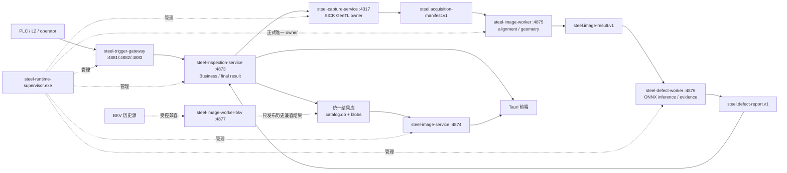

# 原始数据处理链路与独立运行架构

## 固定数据流

正式生产后台固定为一个 SCM Supervisor 和六个受管子服务。业务服务不读取 BKV、共享目录或采集原始目录，也不执行图像解码、几何或模型推理。Supervisor 按图像服务、图像 Worker、缺陷 Worker、采集、业务、触发网关的依赖顺序启动并按反向顺序停止。`steel-inspection-tray.exe` 只控制 SCM，不持有管理员凭据；独立 Tauri supervisor 只可作为互斥的交互式 owner，不能与正式 SCM 或开发脚本同时管理同一端口/EXE。

## 统一结果协议

`steel.inspection-result.v1` 由 `app/result-contract` 定义。图像与缺陷 Worker 只消费 `complete=true`、schema 有效且 SHA-256 可复核的上游合同，发布时先写入同一 NTFS 卷上的 `staging/<job>`，校验来源文件大小与 SHA-256，将二维全分辨率文件放入 `blobs/<sha256>`，再原子切换到 `records/<inspectionId>`，最后在 SQLite 事务中更新 `catalog.db` 的代数、记录、缺陷和制品索引。失败任务不会出现在业务查询中；重复的输入修订、算法版本和制品指纹直接返回已有代数。

业务服务使用 `catalog.db` 的索引查询记录摘要/缺陷/制品。图像服务只接受记录 ID、制品 ID 或算法暂存句柄，检查制品必须是结果库 `blobs/` 下的内容寻址文件，按需生成 JPEG 缩略图/瓦片并通过 ETag 和长期缓存头返回。任何接口都不接受前端任意本机路径。

二维世界瓦片当前使用 `steel.inspection-world-cache.v3` 布局：固定 `512×512`，仅提供 `L0` 至 `L3`，按相机独立、按可视范围生成；边缘不足 512 的区域按实际剩余宽高输出。缓存 URL 带布局版本，旧版 128 像素瓦片不会被浏览器或磁盘缓存误用。

## 输入边界与兼容适配器

正式实际相机链只接受 `steel-capture-service` 原子发布的
`steel.acquisition-manifest.v1`。图像 Worker 发布 `steel.image-result.v1`，
缺陷 Worker 再发布 `steel.defect-report.v1`，最后只有 Business 可以形成生产结论。

- BKV MySQL 与六路 `CamImageSource*` 仅由隔离的 `steel-image-worker-bkv.exe`
  在显式受控迁移/兼容模式读取；它不进入正式 Supervisor、不继承相机角色、
  不重做缺陷推理，也不能影响实际相机最终判定。
- `steel.standard-record.v2` 和文件回放只用于离线迁移或开发，不能申请实际相机
  生产 PASS。

输入 manifest 身份、逐文件哈希、算法版本和配置/标定身份共同构成幂等发布依据。原始采集不可变；图像和缺陷结果是可替换的派生产物。

## 本地启动与部署

- `scripts/run-tauri-dev.ps1` 在提供 `-SickCaptureProfile` 时启动直连处理服务；可用 `-NoProcessingServices` 调试已有后台。脚本会在 `target/run/tauri-dev/logs` 保存各进程输出。
- BKV online 已暂时弃用并隔离，不再由开发脚本隐式启动。仅受控迁移/兼容验证可使用未纳入 Git 的环境文件，例如 `scripts/run-tauri-dev.ps1 -EnvFile config/env/bkv-online.env.local`；文件必须显式启用弃用适配器。业务服务会清除 `STEEL_BKV_*` 并保持结果代理模式，只有独立 BKV 适配器接触原始数据源。
- 后台管理的“运行日志”页调用受 `admin.services` 保护的 `/api/admin/runtime/logs`，展示 Supervisor 状态、4873/4874/4875/4876/4317/4881 进程探针、统一结果目录就绪状态，以及日志文件最近 240 行；前端每 5 秒轮询并在切换页签/卸载时取消旧请求。
- Windows 服务安装脚本为 Supervisor 注入 `STEEL_RESULT_ROOT`、`STEEL_ALGORITHM_INPUT_ROOTS` 和代理模式标志，并创建结果、输入及 image/defect worker 工作目录。
- `steel-inspection-tray.exe` 支持查看状态、打开日志/数据目录、打开 Tauri、启动/停止/重启 SCM，以及当前用户登录自启动；退出该托盘不会停止后台服务。
- `steel-inspection-server-monitor.exe` 是部署在服务器交互式用户会话中的独立 Tauri supervisor，不依赖操作客户端存活。它承担注册服务的进程生命周期，每秒读取真实健康探针；`normal` 模式的进程退出后自动拉起，`manual` 仅响应人工操作，`disabled` 保持停止。右侧可启动、停止、重启并设置模式，底部记录启动、停止、重启、异常退出和自动拉起等持久监控日志。主界面页脚通过仅监听 `127.0.0.1:4899` 的控制接口读取同一状态并执行操作；关闭监控窗口只隐藏到托盘，不停止受管服务。

生产就绪条件同时要求 4874 图像服务、4875 图像 Worker、4876 缺陷 Worker、4317 采集服务、4873 Business、必需的触发网关和 `catalog.db` 可用，并通过算法资格与生产策略门禁；缺任一 required 项都必须使 readiness 失败。
