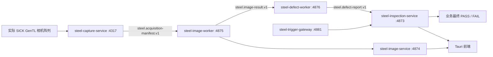

# 实际相机唯一生产链路与独立运行架构

## 固定生产数据流

正式生产只有这一条物理输入线路。采集进程独占相机和 CTI；图像 Worker
只消费已提交的采集清单；缺陷 Worker 只消费实际相机产生的图像结果；只有业务
服务可以生成最终生产判定。模拟、文件回放、旧 LVM/NVT 线路和 BKV 历史数据均
不得进入生产 PASS/FAIL。

## 正式进程数量

正式常驻后台共 7 个 EXE：1 个 Supervisor 加 6 个受管子进程：

- `steel-runtime-supervisor.exe`
- `steel-image-service.exe`
- `steel-image-worker.exe`
- `steel-defect-worker.exe`
- `steel-capture-service.exe`
- `steel-inspection-service.exe`
- `steel-trigger-gateway.exe`

桌面端和托盘是用户会话程序；`steel_bar_surface_core.exe` 是按需计算助手，不是
常驻服务。因此正式发行目录包含 10 个 EXE。若另行构建独立 BKV 兼容项目，目录
总数可为 11 个，但 `steel-image-worker-bkv.exe` 不属于正式生产链路。

## BKV 独立兼容项目

`steel-image-worker-bkv.exe` 使用 4877 端口，可导入并展示历史图片、历史缺陷类型
和已有缺陷事实。它不由正式 Supervisor 启动、不接触实际相机、不执行缺陷重新
识别，也不能影响实际相机的生产判定。历史图片缺失时允许进行图片物化，但该
兼容路径不会调用缺陷算法核心。

## 持久化交接协议

1. `steel.acquisition-manifest.v1`：相机采集提交后的不可变深度、强度和元数据制品。
2. `steel.image-result.v1`：对采集制品进行对齐、ROI、测量和表面处理后的结果。
3. `steel.defect-report.v1`：缺陷 Worker 基于实际相机图像结果产生的识别报告。
4. Business 最终结果：业务服务结合物料、流程和缺陷报告落库并生成 PASS/FAIL。

每个交接均通过文件路径、大小和 SHA-256 约束来源修订。图像与缺陷结果是可重建
的派生制品；原始采集提交不可变。

## 本地与硬件服务器分工

本机负责代码、契约、构建、静态边界与无硬件测试。安装器要求显式传入经过审核
的 SICK profile 和 Python 路径，并校验 CTI、阵列标定、模型清单、四个 ONNX 模型
及每个相机的存储目录。实际相机连通性、CTI/SDK、CUDA、模型精度、吞吐与长稳
测试在硬件服务器上完成。

更详细的边界说明见 `docs/runtime-boundaries-v2.md`。
